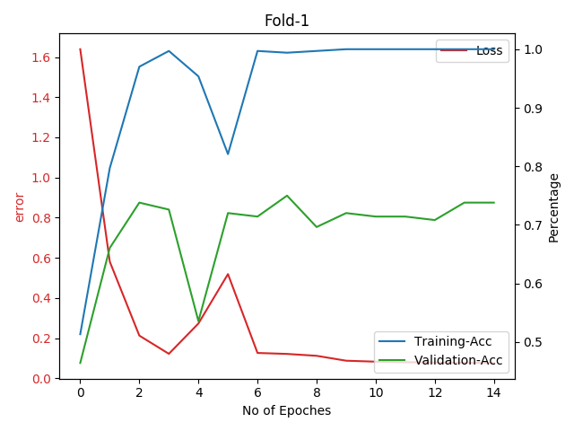

# Multilingual Sentiment Analysis on Social Media Platforms

## Background

## Objective of the research

## Table of Content

- [1. Data-set](#1-data-set)
  - [1.1. Data-set](#11-data-labelling)
- [2. Pre-Processing](#2-pre-processing)
  - [2.1 Sinhala Language](#21-sinhala-language)
  - [2.2. Fixing Vowels](#22-fixing-vowels)
  - [2.3. Simplifying Sinhalese Characters](#23-simplifying-sinhalese-characters)
- [3. Model](#3-model)
- [4. Run the Model - Local Setup](#4-run-the-model-local-setup)
  - [4.1. Requirements to Run the Code Setup](#41-requirements-to-run-the-code-setup)
  - [4.2. Training the Model](#42-training-the-model)
  - [4.3. Build Results](#43-build-results)
- [5. Run the Model - Google Colaboratory Setup](#5-run-the-model-google-colaboratory-setup)
- [6. Testing and Results Analysis](#6-testing-and-results-analysis)
  - [6.1. Experimental Setting](#61-experimental-setting)
  - [6.2. Accuracy and Loss of Folds](#62-accuracy-and-loss-of-folds)
  - [6.3. Confusion Matrices and Results](#63-confusion-matrices-and-results)
- [7. Extending the Data-Set](#7-extending-the-data-set)
  - [7.1. Requirements](#71-requirements)
  - [7.2. Run the Mongo DB](#72-run-the-mongo-db)
  - [7.3. Setup Twitter Keys](#73-setup-twitter-keys)
  - [7.4. Setup Twitter Search Query](#74-setup-twitter-search-query)
  - [7.5. Query with Tweeter](#75-query-with-tweeter)
  - [7.6. Create CSV from Mongo DB](#77-create-csv-from-mongo-db)
  - [7.7. Backup Mongo DB](#77-backup-mongo-db)
  
## 1. Data-set

Data collection is done by with using both Twitter messages and facebook comments.

|    Class      |    Tweets Count    |
|---------------|-------------------:|
|    Neutral    |             700    |
|    Racist     |             700    |
|    **Total**  |          **1400**  |

### 1.1. Data Labelling

## 2. Pre-Processing

## 3. Model

## 4. Run the Model - Local Setup

### 4.1. Requirements to Run the Code Setup

## Training

